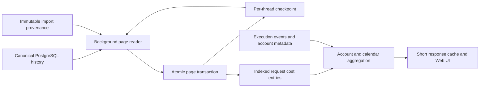

# Incremental account cost statistics

Account history used to replay every relevant conversation for every account,
range and timezone. Once a replay exceeded the 60-second request deadline, each
retry started over and the last successful cached amount could remain visible
indefinitely. Increasing that deadline would not bound repeated work.

## Persistence and restart

Schema 31 adds two disposable projections. `mira_account_cost_checkpoints` stores
the source generation, parsing/price revision, fork/import fingerprint, last
processed sequence and bounded parser state. `mira_account_cost_entries` stores
only charge deltas and attribution inputs: request time, turn, provider, exact
integer nanodollar amounts, pricing coverage and reasons. It contains neither
conversation text nor credentials. PostgreSQL raw history remains authoritative.

One Server-owned worker selects at most 16 threads in oldest-serviced order and
processes at most 1024 relevant records per thread transaction. It waits 25 ms
between busy batches and polls every two seconds when caught up. Each page has a
15-second timeout. A per-thread transaction advisory lock prevents competing
projection writers from applying the same cursor twice, without taking canonical
writer locks. Entries and the parser checkpoint commit together; a lost commit
response is resolved by reading that cursor on the next pass. Shutdown cancels
and joins the worker before closing PostgreSQL.

A failed thread records a stable error code and waits 30 seconds before retrying;
other threads continue. Already committed pages survive the failure. This is
eventual consistency, not an additional synchronous step in model persistence.

Generation, fork source, published import source or projection revision changes
reset the affected thread. Reads join against the current source fingerprint, so
obsolete rows are invisible before the rebuild runs. Pricing changes alter the
revision automatically; parser/timestamp semantics require incrementing the
algorithm revision in `account_cost_projection.go`. Deleting a canonical thread
projection cascades into these derived tables, including during an existing
ThreadStore rebuild. No authoritative record is rewritten.

## Correctness and query cost

The worker reuses the conversation pricing state machine. Copied fork history,
duplicate cumulative counters, usage resets, missing model/request usage and
unknown prices retain their existing treatment. Import provenance supplies the
original timestamp; a source without one is not charged on its import date.

Attribution deliberately remains outside the durable parser checkpoint. The
query resolves exact turn ownership first, then the binding interval at request
time, then an unambiguous historical provider alias. It joins execution metadata
as sets, rather than issuing one query per request. Late completion events,
account switches, renamed accounts and newly ambiguous providers therefore take
effect without reparsing history. Child threads contribute only their own scope.

The HTTP path reads the compact, time-indexed ledger and groups in PostgreSQL by
local date, UTC hour and coverage/model attributes. It does not read raw rollout
payloads. All ranges and timezones share the same parsing work. Daily boundaries
and hour endpoints retain the existing treatment for DST and fractional-offset
timezones. Exact amounts remain NUMERIC integer nanodollars until final display.

The remaining query cost is proportional to projected requests in the selected
calendar window plus execution metadata, not all raw conversation history. If
that becomes a bottleneck, this ledger permits an additional rebuildable hourly
rollup without changing canonical storage or re-reading tool output. That extra
rollup is not part of this implementation.

## Freshness and operations

Amounts and progress use one repeatable-read snapshot. `projection` reports
`status` (`ready`, `updating`, `retrying`), total/pending/failed threads and
processed/total raw sequence counts. Progress is global to the shared projector;
pending unrelated threads can conservatively mark an account result partial.
While building, known amounts carry `projection_pending`; missing amounts stay
unknown. The UI shows progress instead of presenting a partial build as final.

The bounded response cache still merges identical concurrent reads, permits two
aggregations and retains at most 64 account/range/timezone/date keys. Successful
results expire after one minute, or five seconds while the projector is pending.
Query failures retain the previous result with the existing stale marker and a
30-second retry. Cache timestamps describe aggregation time, while `projection`
describes whether source processing has caught up.

To rebuild derived costs, an administrator can delete selected checkpoint rows;
their entries cascade and the background worker discovers the missing cursors.
Do this only as an explicit maintenance action. Routine updates, retries and
account changes do not clear the tables. The previous Server's SQL contract is
unchanged, so Supervisor rollback remains supported.

## Validation

The PostgreSQL integration fixture compares the complete response with the old
canonical scanner, including multi-Node names, handoff, fork exclusion, duplicate
counts, unknown pricing, original import dates and ambiguous provider aliases.
It also exercises pending cold reads, durable multi-page resume, cancellation,
concurrent retries, late ownership, generation replacement, newly published
provenance and cascading deletion. Parser serialization is tested across every
split point in a fork/reset sequence. The canonical scanner exists only in test
code; production HTTP requests cannot fall back to full history replay.
