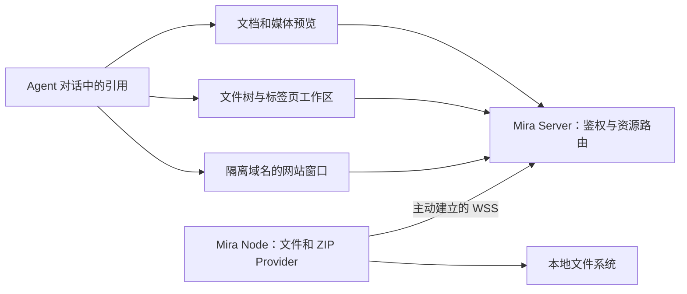

# 对话中的文件引用与预览设计

状态：已批准的实施设计，2026-10-04。用户确认以下交互与架构；“引用回对话”暂不实施。部署准备和功能发布分别验证。

## 1. 需求与产品入口

用户的主要入口是 Agent 对话：Agent 输出涉及文件或目录时，用户点击即可查看内容。

- Markdown：直接阅读渲染结果。
- HTML：可以在新窗口或标签页打开完整静态网站，关联资源按站点路径读取。
- 目录：打开类似 IDE 的文件树和标签页，浏览目录内的文件。
- ZIP：不必整体解压即可浏览包内目录，并预览其中的文件。
- 图片、音频、视频：在 Mira 内查看或播放，无需启动远端浏览器或额外程序。

这里的媒体显示使用用户当前 Web/WebView 的解码能力，不承诺所有容器和编码都可直接播放。

对话里的文件引用、Node 工作区和独立文件页面复用同一资源服务与预览器。实施顺序以对话入口为先，不要求用户先切换到设备管理页找文件。

## 2. 已确认的域名与 HTTPS 选择

每套部署配置独立的预览域名后缀，使用通配符 DNS 和对应的通配符证书。例如，以下均为部署占位域名：

```text
控制台：mira.example.test
预览：  <preview-id>.preview.mira.example.test
DNS：   *.preview.mira.example.test CNAME mira.example.test
证书：  *.preview.mira.example.test
```

另一套部署使用自己的后缀、DNS 记录和证书，不能把两套独立 Mira 实例的预览会话或身份混用。后缀属于部署配置，不硬编码用户的生产域名或地址。

- 一个预览会话分配一个独立子域名；站点内容使用该 origin 的真实根路径。
- 新网站复用已有通配符 DNS 和通配符证书，不为每个网站新增记录、签发证书或重载 Caddy。
- Caddy 使用通配符站点配置，将请求转发给 Mira；Mira 根据 Host 解析预览会话。
- 通配符证书通过 DNS-01 签发，由 Caddy 自动续期；DNS 插件与受限 API 凭证需要在续期时可用。
- 证书通配符只覆盖一层名称，预览 ID 不包含点。裸后缀本身不在该证书的覆盖范围内。
- 预览 ID 仅用于路由，不是访问凭证；持有网址不等于获得读取文件的权限。

批准的选择是通配符方案。固定域名池、端口池和路径改写不作为完整网站预览的默认架构。

Caddy 的包、配置和证书存储继续由各部署既有的服务所有权管理；基础设施改动与 Mira 功能发布分别验证。DNS、证书和站点路由准备完成，并不等于 Mira 的预览资源服务已经实现。

参考：[Caddy 通配符证书](https://caddyserver.com/docs/automatic-https#wildcard-certificates)、[Let's Encrypt DNS-01](https://letsencrypt.org/docs/challenge-types/#dns-01-challenge)。

## 3. 对话中的引用如何呈现

保留 Agent 原有 Markdown 链接和路径表达，不要求每次交付文件都调用一个专门的发布工具。标准文件链接、明确的路径和已有的结构化文件记录均可成为入口。

展示规则：

- 链接保留原文标签，并按已知类型显示轻量图标或动作提示，例如“阅读文档”“打开网站”“浏览目录”。
- 明确的路径可在行内成为入口；不把代码块里的每段文字或普通技术名词识别成文件。
- 无法仅凭引用确定类型时，点击后通过 Node 的 stat 判断，不能只按扩展名判断目录或文件。
- `file.go:42`、带行号的 HTML/Markdown 引用优先打开源码定位；普通文档链接优先阅读，普通 HTML 入口优先网站预览。
- 对话流式输出期间保持链接和打开页面的稳定性，不因后续文本重绘重置用户正在阅读的内容。

后续可以在一个 turn 的交付位置增加紧凑的“本次产物”行，汇集已明确识别的文档、网站和目录；不为每次路径出现都生成一张大卡片，也不把未验证的路径宣传成已存在的产物。

## 4. 点击后的默认行为

| 对象 | 推荐默认行为 | 补充动作 |
| --- | --- | --- |
| Markdown | 在对话旁打开渲染预览 | 原文、分屏、独立标签页、下载 |
| HTML 网站入口 | 在新标签页打开网站 | 查看源码、调整根目录、刷新、关闭预览会话 |
| 目录 | 在新标签页打开带文件树的文件工作区 | 对话旁预览、返回原对话、复制路径 |
| ZIP | 在新标签页的文件工作区展示包内树 | 对话旁预览、下载条目或原包、包内网站预览 |
| 图片 | 轻量图片查看器 | 缩放、原始尺寸、同目录切换、下载 |
| 音视频 | 在预览面板播放 | 独立页面、倍速、视频全屏、下载 |
| 文本/代码 | 带行号的只读源码预览 | 搜索、定位、在工作区打开、下载 |

默认行为与后端类型发现需要一起实现。明确的 HTML 或目录入口可以直接打开独立加载页；未知路径先在预览面板完成 stat，再按类型展示，并提供显式的独立页面动作。不要在异步 stat 完成后突然弹出新窗口。

桌面宽屏下，文档预览与对话并排，用户仍能输入消息、查看运行状态和停止当前 turn。默认阅读不使用阻断对话输入的模态框。窄屏将预览作为全屏阅读视图；返回时恢复对话位置、草稿、附件和文件阅读位置。

目录工作区提供左侧文件树、右侧标签页预览、面包屑和前进后退。首版方案以读取和预览为中心；“直接编辑、保存”是额外的产品决策，不能仅因界面类似 IDE 就默认增加写入行为。

工作区默认以点击的目录或 ZIP 为树根，显示所属 Node 与完整位置。多个文件阅读、目录展开和标签选择都保存在该工作区中；其来源对话作为返回目标。不要打开后先让用户重新选 Node，再从设备文件根目录寻找刚才的输出。

HTML 新标签页的创建必须由用户点击直接触发。先打开同源的鉴权加载页，由加载页创建或取得预览会话，然后进入隔离的站点 origin，避免网络请求完成后再调用 window.open 被拦截。失败时在加载页显示错误与重试入口。

同一资源再次打开时复用已打开的文件标签，保留阅读位置；网站刷新读取当前内容，不每次创建新证书或隐式扩大根目录。

Agent 继续修改已打开资源时，首版提供刷新与变更提示，避免主动重载打断阅读或播放。后续可按资源类型增加用户可关闭的自动刷新。

## 5. 资源归属与历史语义

资源描述至少区分 Node、原生路径、可选的 ZIP 条目和行列定位。预览上下文还包含来源对话/turn、解析相对路径所用的 cwd，以及适用的 Windows 执行上下文。

```text
ResourceRef:
  nodeId
  path
  archiveEntry? / archiveEntryId?
  line? / column? / fragment?

SourceContext:
  sourceThreadId / sourceTurnId
  cwd
  executionContext? / userSessionId?
```

这是一份边界模型，不是已经发布的 API schema。

- 有明确 Node 的引用必须绑定该 Node。
- 兼容旧引用时，优先依据产生该输出的 turn/工具记录解析所属 Node 与 cwd，不能直接使用对话此刻的 cwd 或新的执行 Node。
- 归属缺失或多个 Node 都可能匹配时明确展示候选，不用“哪台机器先找到同名文件”决定归属。
- 相对文档链接按当前文档所在目录解析；ZIP 内链接按当前条目所在目录解析。
- 单个 ZIP 条目的身份独立于显示名称；重复条目名不能无声地选中其中一个。
- Node 离线、文件被移动或删除时展示原因，并保留原资源描述供重试。

文件链接打开的是 Node 上的当前内容，不代表生成该消息时的文件快照。历史输出不因文件预览而重写。对话内已有的历史图片仍按 canonical typed image 数据呈现，不能改成读取当前 Node 文件。

## 6. Markdown 阅读与文件工作区

Markdown 默认使用 Mira 已有的渲染与清理能力，提供标题目录、代码复制、表格和渲染/源码切换。

- 相对图片按所属 Node 或 ZIP 容器懒加载。
- 点击另一个 Markdown，在当前阅读上下文继续导航，提供返回；源码和其他类型交给同一资源分发器。
- 页内标题锚点优先在当前文档定位；外部网址保留普通外部导航语义。
- 大文档显示加载范围和进度，分块解码保留 UTF-8 边界，渲染分段保留代码块与表格结构。
- 普通 Markdown 清理后的正文不运行任意脚本。

目录和 ZIP 使用同一文件树。展开目录才加载其子项，支持分页、取消和虚拟列表，不沿用当前“超过一万项就拒绝浏览”的行为。包内预览只读取选中的条目，不默认整体解压。


## 7. HTML 网站的根目录与访问隔离

入口文件和站点根目录是两个独立字段。例如：

```text
根目录：/work/demo
入口：  /work/demo/pages/index.html
网址：  https://<preview-id>.preview.mira.example.test/pages/index.html
```

`./assets`、`../images` 和 `/assets` 按真实 HTTP 路径解析。站点正确提供 MIME 类型，支持 CSS、字体、JS module、静态 JSON 和多页面导航，不以字符串批量改写网站源码作为基础实现。

普通 HTML 文件链接默认以所在目录为根；用户从目录发起预览则以所选目录为根。已知的结构化产物上下文可提供显式的根目录与入口。资源找不到时显示请求路径和当前根目录，提供调整入口；不能为了补齐资源自动扩大到 Node 的整个 allowed root。

首版负责静态站点。需要构建工具、后端 API 或开发服务的项目，需要另外的开发服务接入设计。

站点 origin 不提供管理员接口，不接收 Node credential。短期预览授权绑定管理员会话、Node、目录或 ZIP 容器、执行上下文和生命周期；跨 origin 引导不把长期凭证放进 URL。脚本只能通过预览服务访问授权范围内的内容。

默认不开放站点 Service Worker、原生 WebView bridge、顶层导航或泛用设备能力。跨域通信仅接受明确的 origin/source 与有限消息。Android 的预览页面不能继承控制台的原生桥接权限。

预览窗口关闭可以主动释放会话，但不能只依赖 unload；会话需要有可续租的期限、显式停止和断连/撤销清理。已读取到客户端的字节无法通过撤销追回。

## 8. 与 Mira 现有架构的结合



Node 继续主动连接 Server。文件读取与 ZIP 解压在持有文件的 Node 执行；Server 不挂载远端设备，不主动连接 Node，不为每个 HTML 预览启动 shell 或通用 HTTP Server。

元数据和有界目录页可复用/扩展现有 capability 服务。媒体、站点资源与下载使用独立、有背压的二进制数据通道，不能把整文件通过 JSON/Base64 控制消息聚合到浏览器内存。

- 普通文件支持 HTTP Range、流式下载和取消；文件变化需明确处理，不能把不同版本的分块当作一致快照。
- ZIP 未压缩条目可以在验证条目边界后直接定位；压缩条目通常顺序解压。
- ZIP 中需要随机定位的压缩媒体，可仅准备选中条目的临时缓存，显示进度、资源预算和取消入口。
- ZIP 元数据索引、缩略图和临时缓存是可重建运行态，不是 PostgreSQL 对话历史。
- 根目录授权、symlink 限制、Windows 用户/系统身份、Node 撤销和有界资源管理继续生效。
- 新能力需完整协议验证、能力协商、共享工具 schema 和端到端验证。旧 Node 保留现有有界读取作为兼容路径，但不能宣称因此具备大媒体随机读取或完整站点预览。

不新增另一套 Agent 会话模型，不修改 Codex/Claude canonical 历史来存储预览运行态。首版尽量从现有记录派生引用；确需持久字段时再明确迁移和重建规则。

## 9. 推荐实施顺序与验收

1. 对话入口与统一分发：Markdown 渲染、目录工作区、行号定位、来源上下文、返回与草稿保持。
2. 资源数据面：媒体 Range、流式下载、取消、目录分页，替换当前整文件 Blob 聚合方式。
3. 完整 HTML 预览：预览会话、通配符 Host 路由、入口/根目录、独立窗口、鉴权和过期清理；与部署 DNS/证书准备配合。
4. ZIP Provider：包内树、包内文档资源、单条目下载、包内站点、压缩媒体缓存。

验收从真实的 Agent 输出点击开始，而不只从设备文件浏览器开始：

- Agent 输出 Markdown 链接，点击即见渲染与相对图片；对话仍能继续输入。
- Agent 输出 HTML 入口，新标签页中的相对/根路径资源、module 和静态 fetch 正常。
- Agent 输出目录链接，可以浏览目录树并打开多个文件，原对话与草稿保留。
- 同一通配符后缀创建多个预览会话，新建网站不触发单域名证书签发或 Caddy 重载。
- 对话换 Node 或 cwd 后，旧引用不悄悄打开新 Node 上的同名文件。
- Node 离线、文件变化、预览授权过期和窗口创建失败均有可见恢复入口。
- 大视频定位、超过一万项的目录和大型 ZIP 浏览保持有界内存、进度与取消能力。
- 桌面、手机、PWA 和 Android WebView 分别验证返回、外部窗口和权限边界。

## 10. 实现与部署定位

- `server/public/file-preview.js`：共用阅读器与文件工作区；对话使用非模态侧栏，独立页面使用目录树和标签页。
- `server/public/files.html` / `files.js`：独立加载页、网站入口和根目录控制。网站缺失资源时可回到控制页重新设置。
- `app.js`：标准文件链接与路径分发，捕获实时输出的来源上下文；历史来源缺失时显式选 Node。行号引用优先源码，远距离行号分块定位并丢弃此前内容。
- `views/file_context.go`：从已有 turn cwd 与执行事件派生来源，保留 canonical 历史及 typed image 语义。
- `file_archive.go` / `file_zip_cache.go`：分页目录、ZIP 虚拟目录、重复条目 ID、版本校验和选中条目的随机读取缓存。
- `file_stream.go` 与 Server channel：Node 主动连接的有界二进制通道，HTTP Range、条件读取、取消与断连清理。
- `miraserver/file_preview.go`：通配符 Host 分发、一次性引导、HttpOnly 授权、过期／关闭／撤销与独立站点边界。
- Android 文件窗口使用单独的 WebView Activity，不安装 `MiraAndroid`；原对话 Activity 保持不变。APK 与真机验收需在发布阶段单独完成。

首版按页显示目录而不将全部条目加入 DOM，文本／Markdown 由用户继续分块加载；手动刷新保留为主要更新方式。ZIP 中央目录与临时解压缓存有明确的资源预算。完整参数、当前边界和部署步骤见[部署说明](file-preview-deployment.md)与[协议](../protocol/file-preview-v1.md)。

通配符 DNS、Caddy 模块／证书和两套线上部署仍是单独的部署工作；仓库实现不能被当作线上已经启用。
