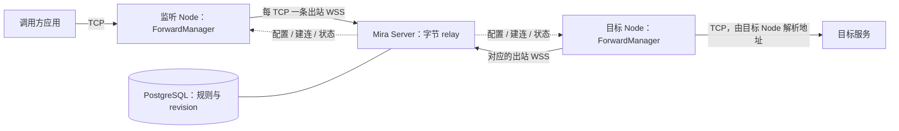

# Mira 托管 TCP 端口转发设计

状态：提案，2026-09-14。本文不表示功能已经实现，也不修改现有转发或生产路由。

## 1. 结论与需求来源

建议新增 `mira forward`：把“监听 Node 的一个 TCP 地址，经 Mira 转到目标 Node 可访问的地址”作为有持久配置、明确状态和生命周期的资源。

推荐数据面是 **每条客户端 TCP 连接对应独立的二进制 WSS relay，仅使用 Node ↔ Server 两段 WSS 的 TLS 加密**。Server 在内存中转发字节，不额外建立 Node ↔ Node 的 TLS/SSH 层。控制连接只负责配置、建连和状态，不承载业务字节。现有 `mira ssh/scp/sftp` 继续采用内嵌 OpenSSH。

Server 是受信任的数据中转点，可以接触转发内容，但不记录业务 payload。应用自身的 HTTPS 原样通过。这个信任边界是本次设计的明确选择。

实施前先用隔离原型比较原生方案与现有 SSH 转发。决定默认后端的依据是并发延迟、吞吐、内存和故障表现，而不是“少了 SSH 就一定更快”。

用户指定对话中的场景是：模型 API 经不稳定的 Tailscale 中继出现慢上传、重传和断流，改走 Mira SSH 后恢复；临时方案由单独的 systemd 服务维护 SSH `-L`，并用 Linux NAT 保持调用方原地址不变。

该对话记录了空载健康检查约 123 ms、隧道进程约 40 MB，以及真实 reasoning 续接成功。这些是当时的观测，**不是本提案的新测量，也不是 SSH 与原生转发的可比性能结论**。实际请求仍受账号池、上游服务及共享带宽影响，不能把所有等待归因于 SSH。

正式功能需要解决四个问题：

1. 配置、启停、重连和可观测性由 Mira 统一维护，减少每台机器的外部脚本。
2. 大上传、慢读连接不会因为共用一条外层 TCP 而阻塞其他独立连接。
3. 长推理和 SSE 不被 Mira 自设的总时长或业务空闲期限截断。
4. 使用已有 Node credential 鉴权，确保连接配对、撤销和资源清理准确。

## 2. 当前实现与选型

现有能力已经包含 TCP 转发：

- [SSH 协议](../protocol/ssh-v1.md) 已公开 `mira ssh -N -L ...`。
- [CLI 适配器](../node/internal/ssh_openssh_cli.go) 将原生转发参数交给内嵌 OpenSSH。
- [SSH relay](../node/internal/miraserver/channel/ssh_relay.go) 使用独立二进制 WSS，单消息上限 64 KiB，有背压，没有 JSON/Base64 业务流量膨胀。
- [集成测试](../node/openssh/tests/e2e.mjs) 验证本地 TCP 转发与 Unix ControlPersist；[Windows 测试](../node/openssh/tests/windows.mjs) 也调用转发验证。
- relay 默认限制为全局 128 个 SSH session、每 Node 32 个；[Node 入站 worker](../node/internal/ssh_supervisor.go) 还有 8 个的独立上限。不能把 relay 配额当成 Node 可用 worker 数。

| 方案 | 收益 | 代价与限制 | 判断 |
| --- | --- | --- | --- |
| 托管一条 SSH `-L` | 最小增量，复用已验证的认证与传输 | 多条 TCP 共享 SSH 外层 TCP，仍可能跨 channel 队头阻塞 | 作为现状基线 |
| 托管一个有界 SSH 连接池 | 缩小共享阻塞范围，保留现有加密 | 进程与连接池管理成本，受入站 worker 配额限制；仍有池内共享 | 原型的对照与备选 |
| 每 TCP 独立 WSS，仅两段 WSS TLS | 连接间流控与故障隔离；无需 SSH 进程和内层加密 | 新增流协议，更多 socket 与外层 TLS 握手；Server 可见转发内容 | 推荐目标 |

独立连接仍共享 Node、Server、网络出口和带宽，也不能拆开同一 HTTP/2 TCP 内的多个请求。原生方案去掉 SSH 加密和进程开销，保留两段 WSS TLS；主要预期收益是隔离和管理，实际提速仍需要测量。

## 3. 第一版使用方式

以下命令为拟议接口；Node 名称只是示例，实际操作须先解析已批准的 Node。

```sh
mira forward create --name api-gateway \
  --listen-node wsl-node --listen 127.0.0.1:17890 \
  --target-node gateway-node --target 127.0.0.1:18787

mira forward list --json
mira forward inspect api-gateway --json
mira forward stop api-gateway
mira forward start api-gateway
mira forward delete api-gateway
```

`create` 持久保存规则并请求启动，返回 `forwardId`、期望状态和当前观测；返回创建成功不等于监听已经就绪。提供 `--wait-ready` 等待有界的就绪确认，该参数不限制隧道或 API 请求寿命。

监听与拨号位置必须明确：

- `listen-node` 是真正打开监听 socket 的 Node，不一定是执行 CLI 的机器。
- `target-node` 是执行 DNS 查询、连接 `target` 地址的 Node。
- 目标 `127.0.0.1` 指目标 Node 的回环；监听地址只在监听 Node 的网络环境中可用。
- 要做通常所谓的“反向转发”，交换两端 Node 的角色即可，不新增另一套 `-R` 资源模型。
- CLI 退出后，托管规则继续存在；它不依赖某个 Codex turn、线程或 shell 进程的存活。

第一版支持 TCP、IPv4/IPv6，以及目标 Node 可访问的回环、内网 IP 或 DNS 名称；目标不强制为回环。监听默认使用回环，支持显式指定 `127.0.0.2`、`::1` 或其他本机 IP。非回环及通配地址必须由调用者明确填写，并在 CLI/Web 中显示暴露范围；不隐式选 `0.0.0.0`，不自动换端口。

第一版暂不纳入 UDP、SOCKS、HTTP 路径代理、公网分享地址、自动发现服务、透明 NAT、后台独立 CLI daemon 或自动选择直连/VPN 路径。临时前台需求继续可用现有 SSH 命令。

## 4. 架构与资源所有权



图中 WSS 箭头表示连接发起方向，建成后的字节流双向传输。每段 WSS 的 TLS 在 Node 和 Server 终止；Server 不打开到目标服务的 socket。

- **Server**：持久规则、权限校验、revision、容量准入、连接配对与字节 relay。
- **Node worker 的 ForwardManager**：监听、目标拨号、流控、连接清理与状态报告。
- **Supervisor**：继续拥有 Node/Server worker 和更新事务，不为每个规则安装系统服务。
- **CLI / Web / dynamic tool**：使用同一规则服务；创建、查询、停止均不传输业务数据。

原生 TCP 转发不是 SSH/SFTP 的另一种实现。它不执行 shell、不读取 Node 文件，也不调用系统 sshd。可以复用有界 WebSocket byte adapter、取消机制和 relay 配对模式，但不把业务 TCP 塞入现有 JSON control/App Server 连接。第一轮实现避免先大规模改造已稳定的 SSH relay。

## 5. 配置、持久化与状态

新增 PostgreSQL 规则表，字段至少包括：

| 字段 | 含义 |
| --- | --- |
| `forwardId`, `name` | 稳定 UUID 和唯一的人类可读名称 |
| `listenNodeId`, `listenHost`, `listenPort` | 实际监听端点 |
| `targetNodeId`, `targetHost`, `targetPort` | 拨号 Node 与目的地址 |
| `enabled`, `revision`, `deletedAt` | 期望状态、单调版本及删除墓碑 |
| `createdBy`, `createdAt`, `updatedAt` | 创建来源与变更时间，不含认证秘密 |

第一版端点字段创建后不可原地更改；更换目标需要创建新规则，或先删除旧规则再创建。这样不会在同一监听地址下把旧连接和新连接悄悄送向不同服务。名称、启停和显式容量配置可以通过 revision 条件更新。

创建、启停、删除使用 operation UUID 幂等；同 UUID 不同请求体返回冲突。更新携带 `expectedRevision`，不能后到的重试覆盖新决定。规则变更与幂等结果在同一事务提交。

规则和必要的幂等/审计记录是持久数据；连接、socket、短期计数和实时报告都是可重建运行态，不逐包写 PostgreSQL。追加迁移，不修改已发布迁移；旧 Server 回滚后可忽略新表，规则仍保留。

报告至少包括：

```text
desiredRevision / appliedRevision / runtimeEpoch / reportedAt
phase: stopped | starting | listening | reconnecting | draining | error
listenerAddress / activeConnections / pendingConnections
bytesToTarget / bytesFromTarget / connectionsOpened / connectionsFailed
lastConnectLatency / lastSuccessAt / lastErrorCode
targetReachability: unknown | reachable | failed
```

`listening` 表示监听已建立、两端控制通道和协议可用，不等于目标应用健康。目标可达性来自实际拨号结果，单独展示。报告过期或 Node 离线时，Server/Web 派生 `unknown/offline`，不继续展示历史绿色状态。计数附带 runtime epoch，重启归零不能解释为流量减少。

配置通过独立、可分页的 desired-forward 同步发送；heartbeat 携带 revision 摘要，避免规则数量放大每次 heartbeat。接收方丢弃旧 revision。首次启动、控制连接重建后必须重新取得当前完整配置，再恢复监听；本地缓存不能覆盖 PostgreSQL。

运行态按当前控制连接 epoch 归属。旧连接的报告、建连票据和异步清理不能覆盖新 epoch 的状态。Server 在每次分配数据连接时重新检查规则、两端凭证及 epoch，不只在创建规则时鉴权。

## 6. 控制接口与 Agent 接口

拟议接口：

| 接口 | 调用者与作用 |
| --- | --- |
| `GET/POST /v1/port-forwards` | 查询/创建规则；管理员或已批准 Node |
| `GET/PATCH/DELETE /v1/port-forwards/{id}` | 详情、启停/有限更新、删除；revision 与幂等校验 |
| `GET /v1/nodes/{ownNodeId}/port-forwards/desired` | Node 获取自己涉及的完整配置，分页快照带 revision |
| `POST /v1/port-forwards/{id}/streams` | 仅监听 Node 为一个已 accept 的 TCP 申请数据连接 |
| `WSS /v1/port-forward-streams/{streamId}/{source|target}` | 两端各出站连接一次，严格匹配 Node、凭证和 epoch |

这些是独立的受信任资源接口，Node bearer 不因此获得 administrator 路由访问权。Web mutation 仍要求管理员 cookie 和 CSRF。沿用 v1 已批准 Nodes 互信模型；端点 Node 都必须仍获批准并支持协议。

两端分别报告 `portForwardV1` 能力。新增 `home_nodes.forward` 管理工具，拟议 actions 为 `list/inspect/create/start/stop/delete`，只返回有界配置与状态，列表分页。工具复用 Server 规则服务，不能绕过持久化、revision 或准入直接启动 Node 监听。

这需要扩展当前 dynamic-tool dispatcher 的服务依赖，不能简单把整个操作转成 Node 的 `capability.invoke`。后者有单次 RPC 期限，不应成为长期转发的生命周期。CLI 的请求 timeout 也只约束管理请求。

`mira ssh/scp/sftp` 继续保持 CLI-only。注入的 Agent 使用说明可以新增 `mira forward` 示例，同时明确 Node 选择、地址归属和持久生命周期。

## 7. 单条 TCP 的协议与安全

### 7.1 建连流程

1. 监听 Node accept TCP 后立即尝试取得本地容量名额；失败则关闭该 socket，不创建等待任务。尚未完成远端建连时不无界预读。
2. 向 Server 申请 `streamId`，携带规则 revision 与本地 operation UUID。Server 原子取得全局及两端容量名额。
3. Server 向目标 Node 发送 `forward.open`，包含规则快照、两端身份、epoch、streamId 和有界建连期限；向监听端返回配对信息。
4. 两端各建立专用 WSS，子协议为 `mira-port-forward-v1` 与现有 `auth.<base64url(node-token)>` 形式。UUID 只作路由，不是 bearer credential；每一端只能 attach 一次。
5. 配对后，监听端发送 `OPEN`。目标端核对 streamId、规则 revision、身份、epoch 和目的地址与控制面票据完全一致，再解析 DNS、拨号。
6. 目标返回 `OPEN_OK` 或结构化错误。成功后才从本地应用读取和发送业务数据。

分配响应丢失时，只在建连阶段复用相同 operation UUID。attach、目标拨号均一次性执行；已失败或结束的 stream 不凭重试复活。连接预算在所有失败、超时和取消路径恰好释放一次。

### 7.2 Node 鉴权与信任边界

直接沿用已有 Node bearer credential 和 `auth.*` WebSocket subprotocol。两端各向 Server 证明身份；Server 验证当前凭证仍获批准，并且精确匹配该 stream 的 source/target 角色及当前控制连接 epoch。

生产数据连接要求 WSS 并正常验证 Server TLS 证书，保持现有 TLS 最低版本约束。仅隔离的本地测试 fixture 使用 WS。不新增 HKDF 派生密钥、公钥注册表、自签名证书、内部 CA 或端到端握手；Node credential 不进入 URL、argv 或日志。

管理员 cookie 不能作为数据面连接凭证。知道 streamId、规则名称或监听地址也不能冒充一端 attach。Server 内存中的 payload 只用于有界转发，不进入审计、调试日志、数据库或错误响应；不宣称 Server 无法读取或篡改业务字节。

撤销任一 Node credential 立即拒绝新分配，关闭相关 relay、监听和活动连接。控制连接丢失、替换或 Server 重启也触发当前 epoch 的清理；网络分区下通过有界存活检测最终收敛，不承诺瞬时跨网络撤销。

### 7.3 字节、EOF 与半关闭

每条 WSS 二进制消息承载一条转发记录，含头总长不超过 64 KiB；WebSocket 底层 frame 分片不改变记录边界。禁止 WSS 压缩。

使用 8 字节头：version（1）、type（1）、保留 flags（2）、大端 payload length（4）。控制 payload 不超过 8 KiB，`DATA` 不超过 65528 字节。类型为 `OPEN/OPEN_OK/OPEN_ERROR/DATA/FIN/RESET`。未知版本/类型、非零保留位、长度不符、非法状态和超长记录立即关闭，不按声明长度无界分配。Server 校验记录封装并转发，不解析应用协议。

- 每个方向的数据独立背压，不跨连接排入一个全局发送队列。
- 本地 TCP 读 EOF 时发送该方向的 `FIN`；对端收到后执行其对接 TCP socket 的 `CloseWrite`，仍保留反方向读取。
- 两个方向 FIN 且已排空后正常关闭 WSS。不能第一个 `io.Copy` 返回就关闭整个连接。
- 异常 socket 错误、协议错误或取消发送有界 `RESET` 并清理。异常 WSS EOF 是断流，不伪装成正常 TCP FIN。
- 不重放已发送字节，不解析或重试 HTTP 请求。连接建立成功不等于请求未执行；任何不确定结果都交给调用方处理。

Mira 不终止应用层 TLS、不改 Host/SNI、不修改 API 认证和 reasoning 内容。应用使用 HTTPS 时，需要应用本身提供可正确验证原服务名称的连接方式，不能靠关闭证书校验迁移到回环 URL。

## 8. 重连、停止与容量

重连恢复的是**规则和新 TCP 连接的可用性**，不是已经断开的 TCP、SSE 或模型请求。

- Node/Server 重启后，旧 TCP 结束；Node 重新同步规则，再建立监听。
- 控制通道不可用时，关闭当前监听和关联流，报告离线；恢复后按配置重新绑定。端口被其他进程占用时报告错误，不杀进程、不自动换端口。
- 目标服务单次拒绝连接只关闭对应流并更新可达性；监听保留，后续新连接可以重试。目标 Node 离线则进入 `reconnecting`。
- 控制重连使用带抖动的退避，例如 1 秒递增至 30 秒；不会建立无限等待的本地 TCP 队列。
- 存活检测使用独立控制连接和 OS TCP keepalive，不能把“应用暂时没有输出”当成失败。控制连接初始建议 ping 15 秒、连续约 60 秒无存活确认后清理；最终值经过弱网测试确定。数据连接正常背压可能暂停读取，不能因此触发固定 WebSocket pong 超时误杀慢连接。
- 配对、WSS 建立和目标拨号各有有界建立期限，例如 30/15/15 秒。建立完成后清除相关 deadline，**不设置默认总寿命、总字节数或应用空闲期限**。

`stop` 默认关闭监听并排空已经进入 `OPEN_OK` 的连接；没有默认的业务排空期限，返回当前 `draining` 状态，不占住管理 RPC。尚在配对/拨号的连接取消。`stop --force` 明确中断活动连接。

`delete` 对无活动连接的规则写墓碑；有活动连接时要求先 stop 并排空，或显式 `--force`。重复命令幂等。源 Node 离线时，只能报告“期望已停止，实际未确认”；Server 同时禁止新分配并关闭应终止的 relay。

并发与内存必须有界，和请求总时长限制分开。原型可从每规则 128、每 Node 512、Server 2048 条活动连接及每 Node 32 条 pending 建连开始压测；这些是待校准的资源默认值，不是固定产品容量。新配置使用 `MIRA_NODE_*` 前缀，Server 端前缀与其配置规范统一。

配额覆盖两个端点的总活动/待建连数，避免只限制监听端。超限立即关闭新接入的 TCP，并在状态中报告 `capacity_exhausted`；已有连接继续工作。TCP 转发不伪造 HTTP 429。每连接业务缓冲保持固定大小，停止读会向原始 socket 传递背压；测试同时统计 TLS、WSS 和内核 socket 的实际额外内存。

ForwardManager 的网络 IO、DNS 和 WSS 建立不持有 heartbeat/control 全局锁。规则与连接均有配额，控制消息有界；流量压力不能无限生成 goroutine、日志或审计写入。

## 9. 系统边界、Web 与观测

监听和拨号使用 Node worker 的 OS 身份及网络命名空间。Windows 不借用交互用户 token；这与 `file/process` 的 user/system 边界是不同操作。Android 受正常网络权限、后台生命周期和 SELinux 约束，不要求 root，也不承诺应用被系统杀死后连接能继续。

原生 TCP 不依赖文件根配置，也不会因为 SSH 被窄 `allowedRoots` 禁用而自动获得文件访问能力。仍须明确：能访问 Node 网络服务是互信模型中的网络能力；文件根不是网络隔离机制。

监听接受字面 IP 和 1–65535 端口，默认回环，非回环只能来自明确配置；目标接受合法 DNS/IP 和端口，拒绝路径、URL scheme、控制字符及无效长度。目标 DNS 在目标 Node 执行，直接使用其正常解析/拨号环境，不读取源 Node 的 DNS 结果或隐式套用 HTTP 代理。拒绝可直接判定的“同 Node 同监听端点”自循环。

Windows/WSL 端口可能因 localhost 转发冲突；指定端口的实际 bind 是最终判断，不能仅靠数据库唯一约束。Node 鉴权保护的是管理和 relay 连接，不会自动认证使用监听端口的应用；回环可被本机其他应用使用，非回环的可达范围由主机网络和防火墙决定，目标服务自己的认证继续生效。

Web 在设备区域增加“端口转发”列表/详情：展示监听 Node、目标 Node、端点、期望/实际状态、活动连接、吞吐和最近错误。提供创建、停止、启动和删除；地址旁明确所属 Node，不能让用户误以为浏览器所在机器的 localhost 就是监听端。

复用现有 CSS token、列表/Inspector、移动端与无障碍模式，不引入框架。运行状态和高频计数不进入对话历史。审计记录规则变更、连接建立/失败类别与关闭原因，排除 payload、认证头、API key 和业务日志；高频连接统计按有界周期聚合，不能每个数据块写库。

故障码区分 `listener_in_use`、`node_offline`、`protocol_unsupported`、`node_auth_failed`、`target_dns_failed`、`target_connect_failed`、`capacity_exhausted` 和 `transport_lost`。延迟拆为配对、WSS 建立、目标拨号及总建立时间，便于判断开销所在。通用 TCP 层不能把应用不读与网络拥塞精确区分，不将背压直接标成“上游推理慢”。

## 10. 透明绕行与现有场景迁移

端口转发只建立连接，不改变路由。现有方案“保持原 API 地址”的效果来自 Linux NAT，单独新增 `mira forward` 不能自动替代这一部分。

第一版迁移顺序：

1. 用不同回环端口创建原生规则，保留现有 SSH/NAT 方案。
2. 先通过隔离客户端验证上传、SSE、认证、reasoning 原样续接和并发。
3. 调用方允许改连接地址时，显式切到新端点；正确处理 HTTPS 服务名称。
4. 仍需透明地址时，沿用现有专用 NAT 适配脚本，在新规则可用后切换新连接，旧连接继续使用原路径。
5. 确认旧连接排空后，再移除旧 SSH 服务。配置保留即可回切新连接；不会宣称旧 TCP 可迁移或恢复。

Mira 核心不自动写 iptables/nftables、Windows portproxy、Tailscale 配置或系统服务。Linux 透明绕行若后续内置，应作为独立显式模式设计：精确匹配用户/目的地址/端口，规则有所有权标识与 revision，启用前验证路径、退出只清理自身规则，处理 WSL 回环和 conntrack，保护 Mira 自身 Server 连接不形成递归。

故障时自动回到原路径也应由明确的路由策略选择，不能由通用 TCP relay 猜测；目标可能要求只经批准通道访问。

## 11. 验证与交付顺序

### A. 隔离原型与性能决策

同一 Node 对、同一 Mira Server 路径、同一目标 fixture，比较：单 SSH、有限 SSH 池、原生每 TCP WSS。另列直连参考，但不用不同网络路径的结果证明协议更快；报告注明原生方案仅含 WSS TLS，而 SSH 方案还有内层加密。

覆盖并发 1/16/64/128、小请求、新建短连接、连接复用、大上传与小请求混跑、持续 SSE、慢读、双向传输，以及注入延迟/丢包。分别测试 SSH `-C` 开/关和可压缩/不可压缩数据；当前临时方案开了压缩，不能忽略它对上传时间的影响。

报告 p50/p95/p99 建连与小请求延迟、持续吞吐、CPU、RSS、socket/FD 数、心跳延迟、错误率和恢复时间。原生按连接建立 WSS/TLS，可能提高短连接延迟，必须单独报告。TCP keepalive/HTTP keep-alive 由应用保持，未来再根据数据考虑有界预连接；第一版不做无限连接池。

原型采用门槛：相同负载下，原生方案应改善大上传混跑时的小请求尾延迟；持续吞吐不能显著倒退（初始参考不超过 10%，需多轮结果和方差支持）；稳定连接数下内存达到平台并可回收，Node 心跳和 App Server 交互保持正常。若不达标，保留托管 SSH 池备选并据实调整后端提案，不直接切换生产流量。

### B. 协议、生命周期与兼容性

- 认证：无效/撤销 Node 凭证、错角色/epoch、过期票据、重复 attach、管理员 cookie 冒用数据面、控制面目的地址不一致、错误 Server TLS 证书。
- 字节：随机二进制、大流哈希、双向背压、半关闭后返回响应、FIN 顺序、RESET、超长/截断/未知记录。
- 长连接：超过原场景 600 秒的上传和 SSE；业务长时间静默但 transport 存活时不截断。
- 故障：两端 Node/Server 重启、网络分区、目标 DNS/拨号失败、端口占用、并发超限、停止与建连竞态、operation UUID 重试、旧 revision 重放。
- 持久性：Server 重启可重建配置，离线删除后重连不会复活，两个客户端并发修改得到冲突，旧 Server 回滚保留规则且诚实报不支持。
- 升级：Supervisor preflight 计入活动转发连接；Node/Server 更新可能中断它们，沿用现有更新事务和告知语义，不增加旁路 updater。
- 平台：native Go/race tests，Windows amd64 与 Android arm64 cross-compile；Windows 原生 bind/双向流/取消；Android debug APK 与真实设备域名 DNS/WSS。未完成设备验收的平台不宣称可用。
- 回归：保留 SSH/SCP/SFTP 及 linked-image E2E；验证 CLI、dynamic tools、Web 管理和嵌入资产同步。测试使用一次性数据库和隔离端口。

### C. 推荐代码落点

| 位置 | 变更 |
| --- | --- |
| `node/internal/forward_*.go` | manager、数据协议、TCP listener、target dial、统计与平台适配 |
| `node/internal/control.go` 等控制入口 | desired 同步、open/close、epoch 和停止清理 |
| `node/internal/miraserver/` | ForwardService、规则 CRUD、追加迁移、幂等及 desired 查询 |
| `node/internal/miraserver/channel/` | 专用 relay、身份与容量准入、dynamic-tool 管理适配 |
| `node/internal/cli.go` / CLI 分拆文件 | `forward` 子命令与稳定 JSON 结果 |
| `server/public/` 与嵌入镜像 | 列表、详情、状态与启停交互 |
| `protocol/port-forward-v1.md` | 原型验证后固化线协议、错误和边界 |

交付顺序为：隔离原型和后端决策 → 持久规则与 CLI → 故障/跨平台验收 → Web 与 Agent 管理 → 单个 API 场景迁移。最后才评估透明路由内置化。

本设计不需要修改 Codex patch、模型请求格式或 ThreadStore。现有 SSH 是可保留的应急路径，转发规则可以恢复，而已经断开的业务连接始终由调用方重新建立。
